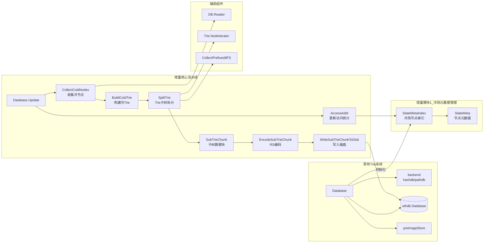

# 基于冷状态 Trie 的以太坊状态分离与纠删码存储
## 一、核心思路
将长期未访问的以太坊状态节点从热状态树中识别并分离，构建独立的“冷状态 Trie”；对该冷 Trie 分块后采用 Reed-Solomon 纠删码编码，最终持久化存储，实现状态分层管理与数据可靠性提升。本实现基于 Geth（go-ethereum）源码进行增量修改。

## 二、整体流程与架构
### 1. 核心流程
```
状态访问统计 → 冷节点识别 → 冷 Trie 构建 → 子 Trie 划分 → 纠删码编码 → 冷数据持久化
```

### 2. 系统架构


## 三、核心模块实现
### 1. 冷状态识别
通过维护**访问元数据**（节点访问时间、路径、Trie 节点信息），调用 `AccessAddr(...)` 记录访问行为，再通过 `CollectColdNodes(...)` 基于时间阈值筛选长期未访问的冷节点，最终生成 `ColdNodesMap (map[path]Node)`。

### 2. 冷 Trie 构建
基于识别出的冷节点，调用 `BuildColdTrie(...)` 完成冷 Trie 构建：遍历冷节点 → 从 Trie 路径恢复 key → 提取叶节点 value → 调用 Trie.Update 插入新 Trie，最终生成仅包含冷状态账户的冷 Trie。

### 3. 子 Trie 划分
为适配存储与编码需求，将冷 Trie 拆分为多个子 Trie：
- **前缀收集**：通过 `CollectPrefixesBFS(...)` 以 BFS 遍历 Trie 生成前缀列表；
- **子 Trie 构建**：通过 `CollectSubTrieWithPrefix(...)` 基于前缀生成 `SubTrieChunk`，每个 Chunk 包含 Nodes（子Trie节点集合）、Proof（子Trie证明）、Root（子Trie根哈希）、Prefix（路径前缀）。

### 4. 纠删码编码
对每个 SubTrie Chunk 调用 `EncodeSubTrieChunk(...)` 执行 Reed-Solomon 编码，采用 `RS(k, 2k)` 策略（k 个数据分片 + k 个校验分片），编码后生成 2k 个 chunk，任意 k 个 chunk 可恢复完整数据。

### 5. 冷数据持久化
编码后的 chunk 通过 `WriteSubTrieChunkToDisk(...)` 写入数据库，在 `rawdb` 中新增 `coldChunkPrefix` 前缀标识冷状态分块数据，数据库存储格式为：`coldChunkPrefix + chunkID → encodedChunk`；同时扩展 `rawdb` 基础接口：`ReadSubTrieChunk`、`DeleteSubTrieChunk`。

## 四、代码修改说明
### 1. 新增功能模块
在 `core/tire/database` 下新增核心函数：
`AccessAddr`、`CollectColdNodes`、`BuildColdTrie`、`SplitTrie`、`CollectSubTrieWithPrefix`、`EncodeSubTrieChunk`。

### 2. rawdb 扩展
- 新增数据库前缀：`coldChunkPrefix`；
- 实现冷数据操作接口：`WriteSubTrieChunkToDisk`、`ReadSubTrieChunk`、`DeleteSubTrieChunk`。


## 五、运行与测试说明

### 1. 编译代码
```bash
make all
```

### 2. 在终端进入data文件夹，用创世区块在四个节点上新起一条链

```bash
 geth init --datadir node1 genesis.json 
 geth init --datadir node2 genesis.json 
 geth init --datadir node3 genesis.json 
 geth init --datadir node4 genesis.json 
```
其中node1和node3是能发起交易的矿工节点，四个节点的地址按顺序如下。
- 0x92424e4f86201c931ba53eb48619d93244c18e13 
- 0x06a1fcbe7a821825b9553d6a7cef1dc470eb2e15
- 0x81374b61e2a1a87fccd88223bd92b52791142634
- 0x1297d56040f2e548ab9d7c1deba623980410cb6c

### 3. 在data目录下，分别在五个终端上运行bootnode和其他四个节点
- bootnode:
```bash
bootnode -nodekey boot.key -addr :30305
```

- node1:
```bash
geth --datadir node1 \
--port 30306 \
--bootnodes enode://efbf2f1ec96876790cd805502b2d8bb03a61f5fcc61b2692e6736d5a70202e8eda7eb16b8b448244363d92c31a5c322988d2ae628f9cf9329dc02bf27039850f@127.0.0.1:0?discport=30305 \
--networkid 123454321 \
--unlock 0x92424e4f86201c931ba53eb48619d93244c18e13 \
--password node1/password.txt \
--authrpc.port 8551 \
--mine \
--miner.etherbase 0x92424e4f86201c931ba53eb48619d93244c18e13 \
--miner.gasprice 0
```

- node2:
```bash
geth --datadir node2 \
--port 30307 \
--bootnodes enode://efbf2f1ec96876790cd805502b2d8bb03a61f5fcc61b2692e6736d5a70202e8eda7eb16b8b448244363d92c31a5c322988d2ae628f9cf9329dc02bf27039850f@127.0.0.1:0?discport=30305 \
--networkid 123454321 \
--unlock 0x06a1fcbe7a821825b9553d6a7cef1dc470eb2e15 \
--password node2/password.txt \
--authrpc.port 8552 
```

- node3:
```bash
geth --datadir node3 \
--port 30308 \
--bootnodes enode://efbf2f1ec96876790cd805502b2d8bb03a61f5fcc61b2692e6736d5a70202e8eda7eb16b8b448244363d92c31a5c322988d2ae628f9cf9329dc02bf27039850f@127.0.0.1:0?discport=30305 \
--networkid 123454321 \
--unlock 0x81374b61e2a1a87fccd88223bd92b52791142634 \
--password node3/password.txt \
--authrpc.port 8553 \
--mine \
--miner.etherbase 0x81374b61e2a1a87fccd88223bd92b52791142634 \
--miner.gasprice 0
```
- node4:
```bash 
geth --datadir node4 \
--port 30309 \
--bootnodes enode://efbf2f1ec96876790cd805502b2d8bb03a61f5fcc61b2692e6736d5a70202e8eda7eb16b8b448244363d92c31a5c322988d2ae628f9cf9329dc02bf27039850f@127.0.0.1:0?discport=30305 \
--networkid 123454321 \
--unlock 0x1297d56040f2e548ab9d7c1deba623980410cb6c \
--password node4/password.txt \
--authrpc.port 8554 
``` 


### 4.通过发起交易触发冷树的构建

由于我们节点元数据的更新和冷树的构建都需要tiredb里的update触发，所以必须发起交易才能触发相关逻辑，为了便于观察，我们设置的由热节点转化为冷节点的高度限制是2，出块的周期间隔是30s，所以我们这么做。

- 再起两个终端，分别运行node1和node3的控制台，用于发起交易。
```bash
geth attach ipc:node1/geth.ipc
```

```bash
geth attach ipc:node3/geth.ipc
```

- 用node1向node2发起交易，node3向node4发起交易。
```bash
eth.sendTransaction({from: eth.accounts[0], to: "0x06a1fcbe7a821825b9553d6a7cef1dc470eb2e15", value: 100, gasPrice:0})
```

```bash
eth.sendTransaction({from: eth.accounts[0], to: "0x1297d56040f2e548ab9d7c1deba623980410cb6c", value: 100, gasPrice:0})
```


- 等待两到三分钟后，让链多出几个块，再用node1向node2发起交易。
```bash
eth.sendTransaction({from: eth.accounts[0], to: "0x06a1fcbe7a821825b9553d6a7cef1dc470eb2e15", value: 100, gasPrice:0})
```


- 此时应观察到node3和node4两个节点转化为冷节点并被编码存储到磁盘上。

## 六、实现状态与未来工作
### 1. 当前实现状态（Prototype）
| 模块                | 状态 | 模块                | 状态 |
|---------------------|------|---------------------|------|
| 状态访问统计        | ✅️   | Reed-Solomon 编码   | ✅️   |
| 冷节点识别          | ✅️   | 磁盘存储            | ✅️   |
| 冷 Trie 构建        | ✅️   | 实际的状态迁移      | ❌️   |
| 子 Trie 划分        | ✅️   | 对mpt架构的修改     | ❌️   |
| Trie Chunk 构建     | ✅️   | 节点的分组          | ❌️   |
| -                   | -    | 实际的去中心化存储  | ❌️   |

### 2. 未来工作
- **冷状态回迁机制**：当冷状态被重新访问时，将其迁回热状态树；
- **去中心化存储扩展**：将编码后的 chunk 存储至 IPFS 或分布式存储网络。

### 总结
1. 核心逻辑是将以太坊冷状态节点分离为独立 Trie，经分块、纠删码编码后持久化，实现状态分层管理；
2. 基于 Geth 增量开发，核心修改集中在 `core/tire/database` 模块和 `rawdb` 扩展；
3. 当前完成基础功能原型，待完善状态迁移、MPT 架构适配及去中心化存储落地。