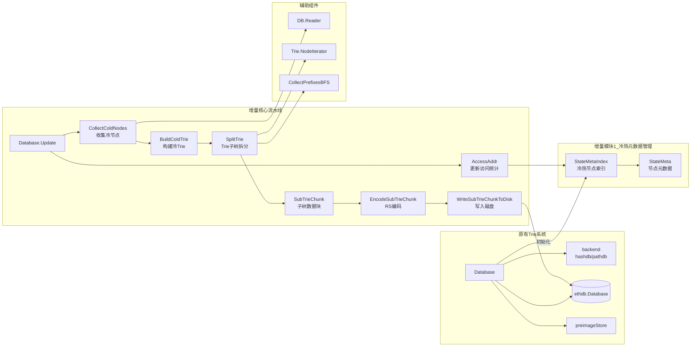

# 基于冷状态 Trie 的以太坊状态分离与纠删码存储
## 一、核心思路
将长期未访问的以太坊状态节点从热状态树中识别并分离，构建独立的“冷状态 Trie”；对该冷 Trie 分块后采用 Reed-Solomon 纠删码编码，最终持久化存储，实现状态分层管理与数据可靠性提升。本实现基于 Geth（go-ethereum）源码进行增量修改。

## 二、整体流程与架构
### 1. 核心流程
```
状态访问统计 → 冷节点识别 → 冷 Trie 构建 → 子 Trie 划分 → 纠删码编码 → 冷数据持久化
```

### 2. 系统架构


## 三、核心模块实现
### 1. 冷状态识别
通过维护**访问元数据**（节点访问时间、路径、Trie 节点信息），调用 `AccessAddr(...)` 记录访问行为，再通过 `CollectColdNodes(...)` 基于时间阈值筛选长期未访问的冷节点，最终生成 `ColdNodesMap (map[path]Node)`。

### 2. 冷 Trie 构建
基于识别出的冷节点，调用 `BuildColdTrie(...)` 完成冷 Trie 构建：遍历冷节点 → 从 Trie 路径恢复 key → 提取叶节点 value → 调用 Trie.Update 插入新 Trie，最终生成仅包含冷状态账户的冷 Trie。

### 3. 子 Trie 划分
为适配存储与编码需求，将冷 Trie 拆分为多个子 Trie：
- **前缀收集**：通过 `CollectPrefixesBFS(...)` 以 BFS 遍历 Trie 生成前缀列表；
- **子 Trie 构建**：通过 `CollectSubTrieWithPrefix(...)` 基于前缀生成 `SubTrieChunk`，每个 Chunk 包含 Nodes（子Trie节点集合）、Proof（子Trie证明）、Root（子Trie根哈希）、Prefix（路径前缀）。

### 4. 纠删码编码
对每个 SubTrie Chunk 调用 `EncodeSubTrieChunk(...)` 执行 Reed-Solomon 编码，采用 `RS(k, 2k)` 策略（k 个数据分片 + k 个校验分片），编码后生成 2k 个 chunk，任意 k 个 chunk 可恢复完整数据。

### 5. 冷数据持久化
编码后的 chunk 通过 `WriteSubTrieChunkToDisk(...)` 写入数据库，在 `rawdb` 中新增 `coldChunkPrefix` 前缀标识冷状态分块数据，数据库存储格式为：`coldChunkPrefix + chunkID → encodedChunk`；同时扩展 `rawdb` 基础接口：`ReadSubTrieChunk`、`DeleteSubTrieChunk`。

## 四、代码修改说明
### 1. 新增功能模块
在 `core/tire/database` 下新增核心函数：
`AccessAddr`、`CollectColdNodes`、`BuildColdTrie`、`SplitTrie`、`CollectSubTrieWithPrefix`、`EncodeSubTrieChunk`。

### 2. rawdb 扩展
- 新增数据库前缀：`coldChunkPrefix`；
- 实现冷数据操作接口：`WriteSubTrieChunkToDisk`、`ReadSubTrieChunk`、`DeleteSubTrieChunk`。


## 五、运行与测试说明

### 1. 编译代码
```bash
make all
```

### 2. 在终端进入data文件夹，用创世区块在四个节点上新起一条链

```bash
 geth init --datadir node1 genesis.json 
 geth init --datadir node2 genesis.json 
 geth init --datadir node3 genesis.json 
 geth init --datadir node4 genesis.json 
```
其中node1和node3是能发起交易的矿工节点，四个节点的地址按顺序如下。
- 0x92424e4f86201c931ba53eb48619d93244c18e13 
- 0x06a1fcbe7a821825b9553d6a7cef1dc470eb2e15
- 0x81374b61e2a1a87fccd88223bd92b52791142634
- 0x1297d56040f2e548ab9d7c1deba623980410cb6c

### 3. 在data目录下，分别在五个终端上运行bootnode和其他四个节点
- bootnode:
```bash
bootnode -nodekey boot.key -addr :30305
```

- node1:
```bash
geth --datadir node1 \
--port 30306 \
--bootnodes enode://efbf2f1ec96876790cd805502b2d8bb03a61f5fcc61b2692e6736d5a70202e8eda7eb16b8b448244363d92c31a5c322988d2ae628f9cf9329dc02bf27039850f@127.0.0.1:0?discport=30305 \
--networkid 123454321 \
--unlock 0x92424e4f86201c931ba53eb48619d93244c18e13 \
--password node1/password.txt \
--authrpc.port 8551 \
--mine \
--miner.etherbase 0x92424e4f86201c931ba53eb48619d93244c18e13 \
--miner.gasprice 0
```

- node2:
```bash
geth --datadir node2 \
--port 30307 \
--bootnodes enode://efbf2f1ec96876790cd805502b2d8bb03a61f5fcc61b2692e6736d5a70202e8eda7eb16b8b448244363d92c31a5c322988d2ae628f9cf9329dc02bf27039850f@127.0.0.1:0?discport=30305 \
--networkid 123454321 \
--unlock 0x06a1fcbe7a821825b9553d6a7cef1dc470eb2e15 \
--password node2/password.txt \
--authrpc.port 8552 
```

- node3:
```bash
geth --datadir node3 \
--port 30308 \
--bootnodes enode://efbf2f1ec96876790cd805502b2d8bb03a61f5fcc61b2692e6736d5a70202e8eda7eb16b8b448244363d92c31a5c322988d2ae628f9cf9329dc02bf27039850f@127.0.0.1:0?discport=30305 \
--networkid 123454321 \
--unlock 0x81374b61e2a1a87fccd88223bd92b52791142634 \
--password node3/password.txt \
--authrpc.port 8553 \
--mine \
--miner.etherbase 0x81374b61e2a1a87fccd88223bd92b52791142634 \
--miner.gasprice 0
```
- node4:
```bash 
geth --datadir node4 \
--port 30309 \
--bootnodes enode://efbf2f1ec96876790cd805502b2d8bb03a61f5fcc61b2692e6736d5a70202e8eda7eb16b8b448244363d92c31a5c322988d2ae628f9cf9329dc02bf27039850f@127.0.0.1:0?discport=30305 \
--networkid 123454321 \
--unlock 0x1297d56040f2e548ab9d7c1deba623980410cb6c \
--password node4/password.txt \
--authrpc.port 8554 
``` 


### 4.通过发起交易触发冷树的构建

由于我们节点元数据的更新和冷树的构建都需要tiredb里的update触发，所以必须发起交易才能触发相关逻辑，为了便于观察，我们设置的由热节点转化为冷节点的高度限制是2，出块的周期间隔是30s，所以我们这么做。

- 再起两个终端，分别运行node1和node3的控制台，用于发起交易。
```bash
geth attach ipc:node1/geth.ipc
```

```bash
geth attach ipc:node3/geth.ipc
```

- 用node1向node2发起交易，node3向node4发起交易。
```bash
eth.sendTransaction({from: eth.accounts[0], to: "0x06a1fcbe7a821825b9553d6a7cef1dc470eb2e15", value: 100, gasPrice:0})
```

```bash
eth.sendTransaction({from: eth.accounts[0], to: "0x1297d56040f2e548ab9d7c1deba623980410cb6c", value: 100, gasPrice:0})
```


- 等待两到三分钟后，让链多出几个块，再用node1向node2发起交易。
```bash
eth.sendTransaction({from: eth.accounts[0], to: "0x06a1fcbe7a821825b9553d6a7cef1dc470eb2e15", value: 100, gasPrice:0})
```


- 此时应观察到node3和node4两个节点转化为冷节点并被编码存储到磁盘上。

## 六、实现状态与未来工作
### 1. 当前实现状态（Prototype）
| 模块                | 状态 | 模块                | 状态 |
|---------------------|------|---------------------|------|
| 状态访问统计        | ✅️   | Reed-Solomon 编码   | ✅️   |
| 冷节点识别          | ✅️   | 磁盘存储            | ✅️   |
| 冷 Trie 构建        | ✅️   | 实际的状态迁移      | ❌️   |
| 子 Trie 划分        | ✅️   | 对mpt架构的修改     | ❌️   |
| Trie Chunk 构建     | ✅️   | 节点的分组          | ❌️   |
| -                   | -    | 实际的去中心化存储  | ❌️   |

### 2. 未来工作
- **冷状态回迁机制**：当冷状态被重新访问时，将其迁回热状态树；
- **去中心化存储扩展**：将编码后的 chunk 存储至 IPFS 或分布式存储网络。

### 总结
1. 核心逻辑是将以太坊冷状态节点分离为独立 Trie，经分块、纠删码编码后持久化，实现状态分层管理；
2. 基于 Geth 增量开发，核心修改集中在 `core/tire/database` 模块和 `rawdb` 扩展；
3. 当前完成基础功能原型，待完善状态迁移、MPT 架构适配及去中心化存储落地。

---

## 七、Fountain MPT Shadow：按 Key 划分的多版本 MPT 编码存储

本节描述当前 `internal/fountainmptshadow` 的完整实现。该模块作为 Geth Trie 数据库之外的 sidecar 工作，不修改基本 IPA 数学，也不改变原有 MPT 节点编码。其目标是在保留所有高度状态根和历史 Key 版本可验证性的同时，让每个存储节点只处理 DHT 分配给自己的 Key，并在 epoch 结束后用 Fr 线性编码块、Pedersen commitment 和聚合 IPA proof 替代完整历史 path。

### 1. 设计目标与边界

当前实现遵循以下原则：

1. 每个高度都记录状态 root 和本高度发生版本变化的 Key；
2. 一个 Key 的所有版本始终由同一个 DHT owner 管理；
3. epoch 内暂时依赖原始 MPT path，不在 sidecar 重复保存 path witness；
4. epoch 结束时只编码该节点负责的 Key；
5. 最新版本使用 epoch 最终 MPT 中的原始 path；
6. 已失效版本只长期保留原始历史叶和相应的可验证关系；
7. 编码系数由 seed 确定性生成，生成矩阵不持久化；
8. 同一节点、同一 epoch 内的 path 行和历史叶关系聚合为一份 IPA proof；
9. 完成持久化和验证材料生成后，原始 path 数据可以由外部裁剪流程删除；
10. proof 的按需传输和网络恢复协议不属于本模块的存储阶段。

这里的“删除 MPT”指允许上层裁剪旧 Trie 节点。模块本身不会在 `Finalize` 内直接删除 Trie；它只保证裁剪后所需的编码块、历史叶、commitment、索引和 proof 已经落盘。

### 2. 代码结构

主要代码位于：

```text
internal/fountainmptshadow/
├── adapter.go          Geth Trie hook、epoch 边界、DHT owner、path 解析
├── epoch.go            每高度 root 和 Key 版本区间跟踪
├── processor.go        epoch 结束时的统一编码和持久化流程
├── framing.go          MPT path 的紧凑 framing/unframing
├── matrix.go           seed 派生的 Fr 编码矩阵
├── encoder.go          path 编码、历史叶关系、恢复与验证
├── aggregate.go        多 witness 直和、关系 folding、单一 IPA proof
├── ethdb_store.go      sidecar 数据库存取、重建和审计
├── compact_codec.go    紧凑确定性二进制持久化格式
└── full_flow_test.go   完整 epoch、删除源 path、重启和验证测试
```

相关公共模块：

```text
internal/ipa/           基础单内积证明
internal/folding/       shared-Q statement folding
internal/fileipa/       path/file 的多行 IPA 组织
internal/mptagg/linearrecovery/
                        根据编码矩阵恢复源 symbol
```

生产接入位于：

```text
core/blockchain.go
cmd/utils/flags.go
eth/backend.go
eth/ethconfig/config.go
```

### 3. Epoch 与版本跟踪

设 epoch 长度为 `L`。高度 `h > 0` 所属范围为：

```text
start = floor((h - 1) / L) * L + 1
end   = start + L - 1
```

例如 `L=16`：

```text
[1,16], [17,32], [33,48], ...
```

每次 canonical block 到来时，`EpochAdapter` 执行：

```text
OnTrieDatabaseUpdate / OnCanonicalBlock
    -> detectAccountUpdates
    -> Processor.RecordHeightWithParent
    -> EpochTracker.RecordHeightWithParent
```

即使某个块没有 Trie update，`OnCanonicalBlock` 仍会记录该高度的 root，避免 root 序列出现空洞。

`KeyUpdate` 的语义为：

```go
type KeyUpdate struct {
    Key            []byte
    PreviousExists bool
    NewExists      bool
}
```

账户 Key 使用：

```text
key = Keccak256(address)
```

当 Key 在高度 `h` 被更新时：

```text
旧版本 TerminalHeight = h - 1
旧版本 TerminalRoot   = root_(h-1)
新版本 StartHeight    = h
```

因此 commitment 和历史叶证明绑定的是旧版本失效时的原始 root，而不是为同一个新版本重复创建 `Q_h`。

版本记录的逻辑类型为：

```go
type VersionRecord struct {
    Key            []byte
    StartHeight    uint64
    TerminalHeight uint64
    TerminalRoot   common.Hash
    Final          bool
}
```

`Final=true` 表示该版本在 epoch 最终 root 中仍然有效；否则它是本 epoch 内已经被后续更新替代的历史版本。

### 4. DHT Key 所有权

每个 Key 的 owner 由固定 seed 和节点总数决定：

```text
digest = Keccak256(
    "fountainmptshadow/key-owner/v1",
    seed,
    key
)

owner = BigEndianUint64(digest[0:8]) mod nodeCount
```

节点只处理：

```text
owner == nodeIndex
```

该映射不包含高度或版本，因此：

```text
同一个 Key 的所有历史版本 -> 同一个 owner
```

不同 Key 集中到某些节点是正常的哈希分布结果。所有节点使用相同 seed、`nodeCount` 和 owner 规则，即可独立得出相同划分，不需要额外保存 owner 表。

### 5. Epoch 结束时的完整处理流程

当当前块达到 epoch 的 `end` 时，`Processor.Finalize` 执行以下流程。

#### 5.1 固化 root 和版本区间

```text
EpochTracker.Finalize
    -> 本 epoch 的 RootRecord[]
    -> 历史版本 + 最终版本 VersionRecord[]
```

生产环境中的 root 不重复写入 fountain sidecar，而是通过 canonical chain database 查询：

```text
height
    -> canonical block hash
    -> canonical header
    -> header.Root
```

独立使用或内存测试没有提供 root resolver 时，仍可回退到 sidecar root 记录。

#### 5.2 枚举本节点负责的最新 Key

模块遍历 epoch 最终 root 对应的 MPT：

```text
finalRoot -> Trie iterator -> all final keys
```

只保留 DHT owner 等于本节点的 Key。

#### 5.3 解析原始 path

对每个负责的 Key：

```text
TriePathResolver.PathNodes(finalRoot, key)
    -> trie.Prove(key)
    -> root-to-leaf canonical MPT RLP nodes
```

历史版本则使用：

```text
TriePathResolver.PathNodes(version.TerminalRoot, version.Key)
```

`Bh,k` 就是该 root 下 Key 的原始 MPT path 节点序列。只要旧 Trie 尚未裁剪，它已经存在于 TrieDB 中，因此 sidecar 不临时复制第二份 `Bh,k`。

#### 5.4 构建最新 path 编码

每条 path 调用：

```text
BuildEncodedPath
    -> FramePathNodes
    -> GenerateMatrix
    -> encodeBlocks
    -> buildPathProof
```

#### 5.5 构建历史叶关系

每个已失效且归本节点管理的版本调用：

```text
BuildHistoricalLeaf(
    StartHeight,
    TerminalHeight,
    TerminalRoot,
    Key,
    originalPathNodes
)
```

历史叶只长期保存原始 leaf RLP。用于证明的 selector、path witness 和历史 `C` 可由 leaf、布局和 aggregate relation 重建，不重复持久化。

#### 5.6 建立 epoch aggregate

所有最新 path segment 和历史叶 segment 进入：

```text
buildEpochAggregate(finalHeight, segments)
```

本地节点在一个 epoch 内，无论负责多少 Key，正常情况下只生成一个 `EpochAggregate` 和一份最终 IPA proof。

#### 5.7 持久化

写入顺序为：

```text
SaveEncodedPath
SaveHistoricalLeaf
SaveEpochAggregate
```

落盘后重新打开数据库，可以不依赖内存对象重新加载 relation、编码块、commitment 和 proof。

### 6. 原始 path 的紧凑 framing

一个 path 是多个长度不一的 MPT RLP node。为避免按照最大节点长度对所有节点补零，`FramePathNodes` 先把每个节点转换为紧凑流，再按固定 symbol 大小切分。

参数为：

```text
SourceChunkSize  = 31 bytes
SourceSymbolSize = 8 * 31 = 248 bytes
```

31 字节可以无损映射到一个 BN254 Fr 元素。每个 source symbol 包含 8 个 Fr chunk；只有最后一个 symbol 允许补零。

布局信息：

```go
type PathLayout struct {
    NodeCount    uint64
    SourceCount  uint64
    FileSize     uint64
    CompactBytes uint64
}
```

其作用为：

- `NodeCount`：恢复后应拆出多少个 MPT node；
- `SourceCount`：编码矩阵列数；
- `FileSize`：固定为 248；
- `CompactBytes`：去掉最后补零并恢复节点边界。

因此不会再出现“每个 path 都按照最大 MPT node 大小补齐”的浪费。

### 7. Fr 线性编码矩阵

矩阵由 seed 确定性生成：

```text
matrixSeed = Keccak256(
    epochSeed,
    finalHeight,
    root,
    key
)
```

实际代码使用 domain-separated `derivePathSeed` 和 `matrixDigest`。

矩阵元素属于 BN254 scalar field `Fr`，不是文档早期图示中的 GF(2) XOR。每个编码 symbol 为：

```text
encodedRow[j] = sum_i matrix[row][i] * sourceSymbol[i][j]
```

其中 `j` 为 0 到 7 的 chunk 坐标。

`--fountainmptshadow.rows 1` 是最低存储模式：

- 每个 Key 只生成一条 seed-derived repair row；
- 每行默认稀疏选择约四分之一 source；
- 至少选择两个 source（若 source 数足够）；
- 单个节点的一行通常不足以恢复多 source path；
- 当前唯一 owner 模式不会让其他节点自动为同一 Key 生成额外行，因此 `rows=1` 主要用于最低存储和 proof 开销实验，不能保证完整 path 可恢复；
- 若要求恢复，必须提高 `rows`，或者在网络层增加同一 Key 的多 owner/replication，使多个独立编码行组成满秩子矩阵。

当 `rows > 1` 时，矩阵保留 full-rank identity prefix，并将行数扩展到二次幂，便于本地独立恢复和 folding。

生成矩阵不落盘。验证方和恢复方根据 seed、Key、root 和规范顺序重新生成。

### 8. 编码块 C 与 path commitment Q

设一条紧凑 path 的 Fr witness 为：

```text
B = [source_0_chunk_0, ..., source_n_chunk_7, padding...]
```

对矩阵的一行和某个 chunk 坐标，构造展开系数向量 `A_(row,chunk)`。该向量只在相应 chunk 坐标放置矩阵系数，其余位置为零。

编码块标量为：

```text
C_(row,chunk) = innerProduct(A_(row,chunk), B)
```

一条编码行有 8 个 chunk，因此最低存储模式下，每条 path 持久化 8 个 Fr 标量 `C_i`，而不是一个无法区分内部 chunk 的总和。

path commitment 为：

```text
Q = CommitB(B)
```

它绑定完整的原始 path witness。IPA statement 可由验证方重建：

```text
P = CommitA(A) + Q + C * U
```

### 9. 历史叶的证明语义

历史叶不是一个由历史叶重新拼出的 epoch path，也不存在新的 epoch `Q`。它始终和该版本 `TerminalRoot` 下的原始 path commitment 搭配。

逻辑上，历史叶对应原始 path witness 尾部的坐标选择：

```text
[0, 0, ..., leafChunk_0_position = 1, ...]
[0, 0, ..., leafChunk_1_position = 1, ...]
...
```

即每个 leaf Fr chunk 对应一个 coordinate-selector relation。其他 path 坐标全部为零，因此内积结果就是相应的 leaf chunk。

持久化时：

- 保存 canonical raw leaf RLP；
- 保存其所属 aggregate 的定位信息；
- selector 根据 `CompactBytes`、leaf 长度和规范 chunk 顺序重建；
- 历史 `C` 直接由 raw leaf chunk 得到，不额外保存；
- commitment 使用产生该历史叶的原始 `TerminalRoot` path 的 `Q`。

这样旧父节点 path 被裁剪后，验证方仍能验证该 leaf/value 曾属于对应 root 下被承诺的原始 path。

### 10. 多 witness 聚合与单一 IPA proof

不同 Key 的原始 path witness 不相同，因此其 segment commitment 也不同。模块不是错误地在 shared-witness folding 中计算：

```text
Q* = Q_left + chi * Q_right
```

而是先把本地所有 segment witness 放入一个规范顺序的直和向量：

```text
B* = B_0 || B_1 || ... || B_n
```

每个原始 relation 的 `A_i` 扩展到全局长度：

```text
A_i* = [0 ... local_A_i ... 0]
```

于是：

```text
innerProduct(A_i*, B*) = innerProduct(local_A_i, B_i) = C_i
```

全局 commitment 利用 Pedersen commitment 的加法同态性重建：

```text
Q* = Q_0 + Q_1 + ... + Q_n
```

现在所有扩展后的 statements 共享同一个 `Q*`，可以使用现有 folding 规则：

```text
A* = A_left + chi * A_right
C* = C_left + chi * C_right
Q* 保持不变
```

folding challenge 由 transcript 和 domain 确定性生成，不持久化。最终只对 folded root statement 生成一份基础 IPA proof。

`EpochAggregate` 的逻辑类型为：

```go
type EpochAggregate struct {
    Height       uint64
    PathSeedBase []byte
    Relations    []AggregateRelation
    Segments     []AggregateSegmentCommitment
    Proof        *fileipa.FoldedFileIPAResult
}
```

其中：

- `Relations` 描述每个公开 `A/C` 关系；
- `Segments` 保存各 witness segment 的 commitment `Q_i`；
- `Proof` 是整个本地 epoch 的单一 folded IPA proof；
- 全局 witness `B*` 和全局 `Q*` 均不单独持久化。

### 11. 验证流程

验证一个最新 Key 时：

```text
1. 用 (root,key) 查询 path locator
2. locator 得到 aggregateHeight 和 aggregateID
3. 加载 EpochAggregate
4. 在 Relations 中定位该 Key
5. 从 epoch seed 派生 path seed
6. 重建 Fr 编码矩阵和各 A_i
7. 读取该 Key 对应的 C_i
8. 从 Segments 取得本 path Q_i
9. 汇总全部 segment Q 得到全局 Q*
10. 重建 folding challenges 和 folded root statement
11. 验证 aggregate IPA proof
```

验证历史叶时：

```text
1. 用 (terminalRoot,key) 查询 history locator
2. 读取 canonical raw leaf
3. 加载 locator 指向的 EpochAggregate
4. 找到对应 historical relation
5. 根据 leaf 和布局重建 chunk、selector 和 C
6. 从对应 segment 得到原始 path commitment Q_i
7. 重建全局 Q*、folding root 和 IPA statement
8. 验证同一份 aggregate IPA proof
```

当前 API 验证的是完整 aggregate proof。若网络请求只发送单个 Key，响应方还需要发送验证该 aggregate root 所需的公共 relation/commitment 数据；后续可在网络层增加 Merkleized aggregate manifest 或 opening proof，以减少单 Key 请求携带的其他关系数据。

### 12. 恢复流程

最新 path 恢复使用：

```text
RecoverPath
    -> 收集同一 source layout 的足够多编码行
    -> 对每个 chunk 坐标形成列向量
    -> linearrecovery.RecoverSingleNodeFromMatrix
    -> FrChunksToBytes
    -> UnframePathNodes
```

恢复成立的条件是收到的编码矩阵子集对目标 source 具有足够秩。`rows=1` 只表示每个 owner 保存一行，不表示单节点一定可以独立恢复整条 path。

当前实现中每个 Key 只有一个 owner，所以只有一条总编码行；对于包含多个 source symbol 的 path，该配置不能保证恢复。完整恢复实验应使用 `rows > 1`，或先实现同一 Key 的多副本 owner。

历史叶不需要矩阵恢复，直接从 locator 中保存的 canonical raw leaf 读取；编码和 IPA 用于证明其合法性。

### 13. 实际持久化内容

当前 sidecar 使用六类单字节 key 前缀：

```text
0xf0 root fallback
0xf1 version index
0xf2 encoded path locator
0xf3 historical leaf locator
0xf4 epoch aggregate
0xf5 baseline node-update statistics
```

生产环境启用 canonical root resolver 后，不写 `0xf0` root fallback。

#### 13.1 Version index

```text
DB key = 0xf1 || Keccak256(terminalRoot || key || startHeight)
value  = RLP(terminalHeight, final flag)
```

用于描述 Key 版本有效区间和本地历史版本索引。

#### 13.2 Path locator

紧凑值只包含：

```text
formatVersion
aggregateHeight
aggregateID
```

`NodeCount`、`CompactBytes`、Key、root、seed、C、Q 和 proof 不在 locator 中重复保存。

#### 13.3 Historical leaf locator

紧凑值只包含：

```text
formatVersion
aggregateHeight
aggregateID
canonicalRawLeaf
```

版本区间和 path layout 由 aggregate relation 恢复。

#### 13.4 Epoch aggregate

紧凑值包含：

```text
formatVersion
height
sharedPathRoot
epochPathSeedBase
compactRelations
segmentCommitments
path RowCs
single IPAProof
```

历史叶 `C` 可从 leaf 推导，因此 `RowCs` 只保存最新 path 的编码块标量。

#### 13.5 不持久化的数据

```text
原始最新 path witness
历史完整 path witness
全局直和 witness B*
生成矩阵
展开后的 A 向量
folding padding rows
folding challenges
全局 Q*
历史叶 C
```

### 14. 紧凑二进制格式

聚合 path、历史叶和 aggregate 使用 `compact_codec.go` 的确定性格式：

- 1 字节 format version；
- `uvarint` 编码非负整数；
- hash、Fr scalar 和压缩 G1 使用规范字节；
- 变长字段使用长度前缀；
- 所有字段按固定规范顺序排列；
- decoder 拒绝截断记录和尾随数据。

这避免了旧 RLP 固定 struct 中大量空字段和长字符串数据库前缀。

非聚合的独立测试/兼容路径仍保留原 RLP value 解码分支，但生产聚合记录使用紧凑格式。

### 15. 存储开销口径

统计工具：

```bash
go run ./cmd/fountainmptstats -nodes 4
```

`coreTotal` 包含：

```text
encodedBlocks
historicalLeaves
commitments
IPA proofs
```

`exactKV` 为：

```text
所有 fountain sidecar 记录的
sum(len(databaseKey) + len(databaseValue))
```

它包含 core 数据、version index、locator、relation 元数据和紧凑格式头，但不包含 LevelDB/Pebble 的 SST、WAL、索引、压缩和文件系统分配。

`physicalLevelDB` 是 sidecar 数据目录的实际文件大小。

`node-stats` 只用于实验中统计原始 MPT baseline，不计入 fountain `exactKV`。

### 16. 当前 epoch=16 四节点实验结果

实验参数：

```text
nodes             = 4
epochLength       = 16
minimumRows       = 1
rounds            = 4
keysPerRound      = 40
hotKeyPercent     = 30
finalHeight       = 32
```

当前紧凑格式结果：

```text
original MPT one copy     = 44,201 B
original MPT four copies  = 176,804 B

encoded blocks            = 51,200 B
historical leaves         = 4,536 B
commitments               = 7,744 B
IPA proofs                = 5,824 B
core total                = 69,304 B

version indexes           = 6,660 B
other metadata            = 37,356 B
exactKV                   = 113,320 B
physical LevelDB          = 135,960 B
```

相对四节点各保存一份完整原始 MPT：

```text
coreTotal / four MPT copies = 0.392
exactKV   / four MPT copies = 0.641
```

即本次负载中：

```text
核心协议数据节省约 60.8%
完整 exactKV 节省约 35.9%
```

proof 审计结果：

```text
aggregateProofs  = 8
invalidProofs    = 0
misplaced        = 0
duplicateRecords = 0
```

这里的 MPT baseline 会受交易被打包到哪些块影响，因此不同运行之间应优先比较同一次运行中的 ratio，而不是只比较绝对字节数。

### 17. Geth 启动参数

启用 Fountain MPT Shadow：

```text
--fountainmptshadow
```

相关参数：

```text
--fountainmptshadow.epoch <epoch length>
--fountainmptshadow.rows <minimum encoded rows per key>
--fountainmptshadow.nodes <DHT node count>
--fountainmptshadow.nodeindex <local node index>
```

四个节点必须使用相同：

```text
epoch
rows policy
nodes
owner seed
```

每个节点使用不同且范围合法的：

```text
nodeindex in [0, nodes)
```

### 18. 四节点实验脚本

构建 Geth：

```bash
GOCACHE=/tmp/go-build-cache go build -o /tmp/fountain-geth ./cmd/geth
```

只启动四节点 Fountain 网络：

```bash
GETH_BIN=/tmp/fountain-geth \
EPOCH_LENGTH=16 \
MINIMUM_ROWS=1 \
scripts/start-fountain-shadow-4nodes.sh
```

发送带 30% 热点 Key 的多轮交易：

```bash
ROUNDS=4 \
KEY_COUNT=40 \
HOT_PERCENT=30 \
WAIT_BLOCKS=4 \
EPOCH_LENGTH=16 \
scripts/send-fountain-shadow-rounds.sh
```

完整清链实验由以下脚本组织：

```bash
GETH_BIN=/tmp/fountain-geth \
GOCACHE=/tmp/go-build-cache \
EPOCH_LENGTH=16 \
FINAL_SETTLE_SECONDS=20 \
STOP_MINING_AFTER_WORKLOAD=true \
MINIMUM_ROWS=1 \
ROUNDS=4 \
KEY_COUNT=40 \
HOT_PERCENT=30 \
WAIT_BLOCKS=4 \
scripts/run-fountain-shadow-experiment.sh
```

`STOP_MINING_AFTER_WORKLOAD=true` 用于在最终 epoch 边界停止继续挖矿，避免等待其他节点结算时又生成额外空 epoch。

### 19. 测试

模块测试：

```bash
go test ./internal/fountainmptshadow
```

core 集成测试：

```bash
go test ./core
```

全仓测试：

```bash
go test ./...
```

测试覆盖：

- epoch root 和版本区间；
- DHT owner 唯一且不随版本变化；
- path framing/unframing；
- seed 确定性矩阵；
- 编码块恢复；
- 历史叶 selector；
- shared-Q folding；
- 多 witness 直和聚合；
- 单一 aggregate IPA proof；
- commitment 或数据篡改拒绝；
- compact path/history/aggregate 落盘；
- canonical root resolver 不重复写 root；
- 删除源 path 后重新打开数据库；
- 最新 path 和历史叶重新验证；
- 同 root/key 的新 aggregate 不破坏旧历史 aggregate；
- 所有持久化 proof 审计。

### 20. 当前限制与后续工作

1. `rows=1` 是分布式最低存储模式，单节点通常无法恢复多 source path；网络层需要收集足够多且线性无关的行；
2. 当前每个 Key 只有一个 DHT owner，没有内置副本因子；生产部署需要增加可配置 replication；
3. aggregate proof 验证需要重建整个本地 epoch 的公共 statement；单 Key 低通信验证仍需 Merkleized manifest/opening；
4. 当前只检测账户 Trie Key；storage Trie Key 的统一 owner 和版本跟踪需要继续接入；
5. 模块准备好了裁剪后的验证材料，但不直接执行 Trie 节点删除；
6. 新 sidecar 使用单字节 key 和版本化紧凑二进制格式；旧长前缀 sidecar 若要原地升级，需要迁移工具；
7. 空 epoch 当前仍可能重新编码最终 path，后续可根据 root/dirty set 跳过未变化 epoch；
8. 实验 IPA 参数使用当前项目的 deterministic test params，生产环境需要固定并审计正式参数生成方式。
